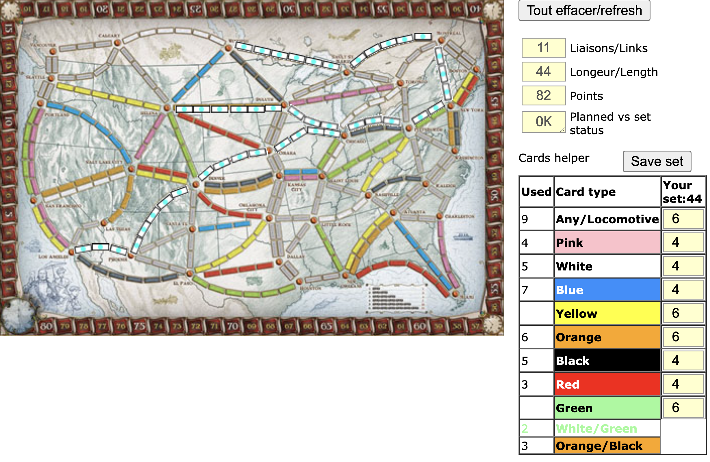

TicketToRide Simulator edited by choosen

Most recent version:
|

`TODO.list` has my future ideas.

You can enter your full setup 
by leaving color inputs (example: shift+tab) and paste numbers values in new lines.

You can pass query params also to init colors with them, ex: TTRsimulations.html?0=10&1=12
Click `Refresh routes` button clear selected routes and store current colors set into query params.

Click `Save set` button to store default initial setup
 and open new window (without query params) with the same color set.

By default there is 44 seed with 6 locos and 6/4 per colors

BUGS:
1. OK STATUS is not splitting colors right into any color tracks
1. OK STATUS is not checking at all dual colors tracks

Initial version
|